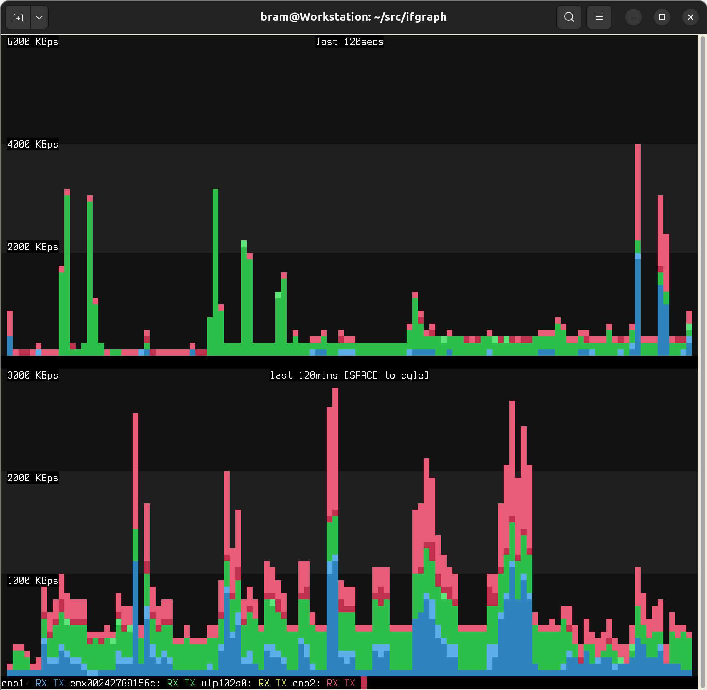

# ifgraph
Network Interface Grapher.



# Description

The ifgraph tool will show a running graph of the bandwidth use of your network interfaces.

On top, it will show a live-view of current bandwidth use, and ticks one sample per second.

On the bottom, a long-term view of bandwidth use is presented, where you can cycle between a tick per minute, per hour or per day.

# Unique Features

The stand out feature of this tool is the zero load it places on your host.
I've measured the CPU usage to be 0.0% on my machine.

This is because ifgraph uses a simple in-memory ring-buffer to store the data.
This ring-buffer is stored in shared memory, so not a single disk-access will be required. It really is the lightest of tools.

The ifgraph tool has zero dependencies, and is two small programs written in C.

The ifgraph tool will show RX/TX bandwidth, aggregated over multiple network devices.
This enables you to quickly see what the traffic volume is on your WAN, your LAN, your WIFI, etc.

# Building

This tool has zero dependencies.
Just type `make` on the command line.


# Usage

The tool comes in two parts, each of which is a simple C program:

ifgraphd: back-end

ifgraph: front-end

The ifgraphd back-end process does the recording and runs as a daemon, in the background.

The front-end process plots the graph in a terminal window that supports 24b colour, like a gnome terminal, xterminal, or anything similar. The front-end you can close and open at any time, and runs in the foreground.

The back-end needs to be started first, and takes optional command line parameters.
By default, it will record statistics of all your network devices.
But if you want to limit the set, you can provide the network devices on the command line, like so:

```
./ifgraphd eno1 eno2 &
```

To view the data that has been recorded, you launch the front end in a terminal window:

```
./ifgraph
```

# Make targets 

```sh 
make all
sudo make install
ifgraphd

# or 
sudo make systemd

# or
sudo make initd

#finaly
ifgraph 

sudo make unsystemd
sudo make uninitd
sudo make uninstall
make clean
```

# Author

The ifgraph tool is (c)2023 by Bram Stolk

# License

MIT

